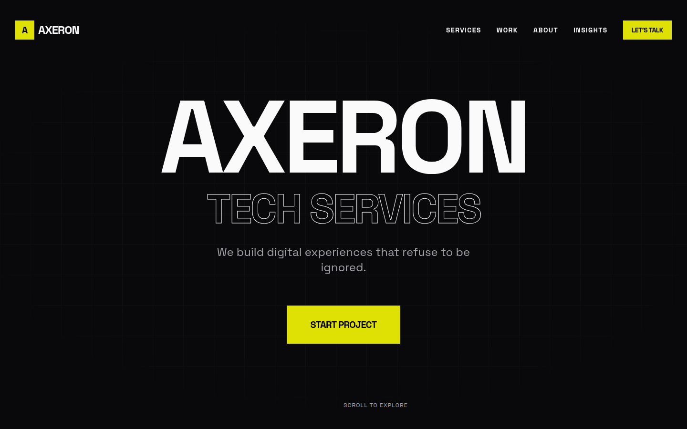
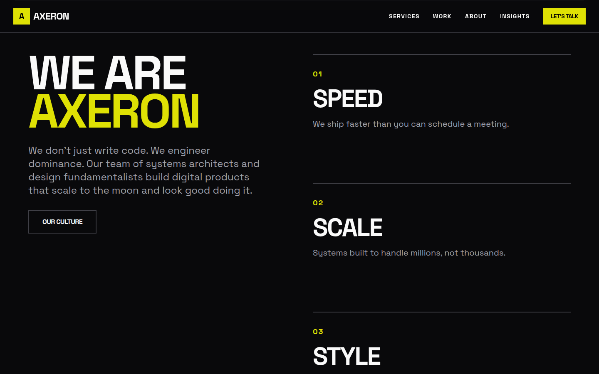
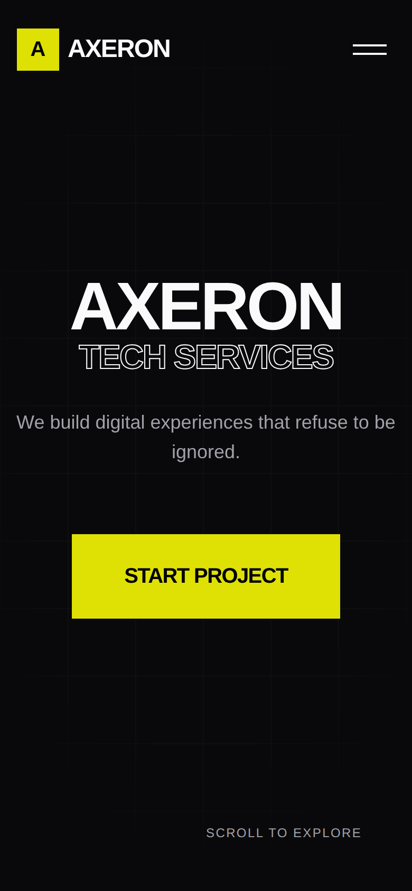

# Axeron — Agency Landing Page

A one-page landing site for a fictional tech agency, Axeron Tech Services. The design is brutalist: oversized type, outline lettering, a strict black-and-yellow palette, and a scrolling marquee in the footer.



| About section | Mobile |
| --- | --- |
|  |  |

## Sections

- **Hero**: headline, tagline, and call to action
- **Services**: four numbered cards (Web Development, UI/UX Design, Backend Systems, DevOps)
- **About**: "We are Axeron" with Speed, Scale, Style, and Impact
- **Contact**: project enquiry form (layout only; not connected to a backend)
- **Footer**: infinite marquee, social links, and contact details

## Tech stack

- React 19 with TypeScript
- Vite 7
- Tailwind CSS
- Framer Motion for button and section animations
- react-fast-marquee

## Run locally

Requires Node.js 20 or newer.

```bash
npm install
npm run dev      # start the dev server at http://localhost:5173
npm run build    # type-check and build to dist/
npm run preview  # serve the production build
npm run lint
```

## Project structure

```text
src/
├── App.tsx
├── pages/Home.tsx
├── components/
│   ├── blocks/    Hero, Services, About, Contact
│   ├── layout/    Navbar, Footer, Section
│   └── ui/        Button
└── lib/           shared helpers
```
